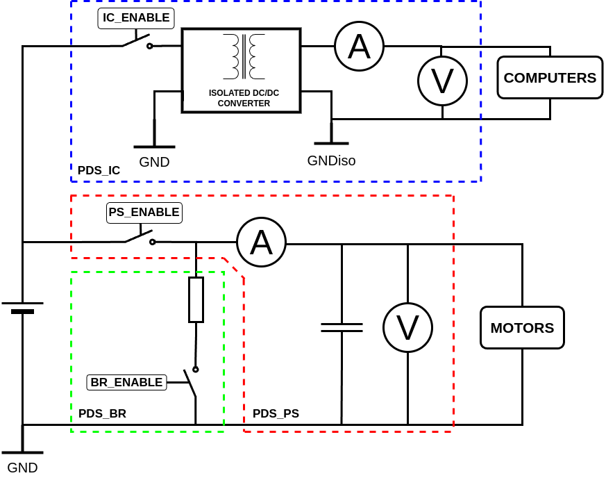

(pds)=

# PDS - Power Distribution System

## Overview
For robots, particularly mobile ones, it’s crucial to have robust power distribution systems that ensure reliable, safe operation, energy efficiency, and seamless integration with components like motors, sensors, onboard computers, and subsystems. Additionally, the challenge is to make these systems compact and lightweight. MAB PDS addresses all these requirements, offering a comprehensive, integrated solution that simplifies the construction of robots while meeting all essential power management needs in a small, efficient form factor.

With the MAB PDS, robotic researchers, engineers, and system integrators can focus on higher-level development instead of being limited by hardware and embedded firmware design, which can be time-consuming and complex.

The MAB PDS is built on a modular philosophy designed to meet the core needs of every robot:

* High-power bus for motors with on/off control,
* Safe power bus for the computers and sensors with on/off control,
* Handling regenerative energy from motors,
* Monitoring all the parameters related to power supplies and energy consumption,
* Power switch to enable/disable the robot,
* Fast and reliable handling of safety triggers,
* Fast telemetry and control from a higher-level controller,
* Scalability for flexible system expansion.

## Modules
To handle all these features, the MAB PDS is split into four different types of modules:
* control (CTRL) - master module of the system, 
* isolated DC/DC converter (IC) - a module with an isolated DC/DC converter for peripherals like computers and sensors, 
* power stage (PS) - a module that handles high-power delivery to the motors,
* brake resistor (BR) - complementary subsystem with the Power Stage module

The overview of what exactly the PDS slave modules do is presented in the simple scheme below:



The master (CTRL) module manages ENABLE signals, acquires current/voltage measurements, and communicates with external systems.

```{important}
For detailed description refer to <a href = ../docs/pds_guide_1.0.pdf>PDS Guide</a>
```