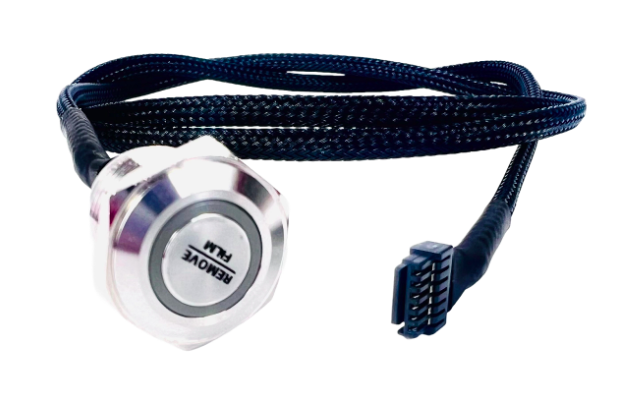
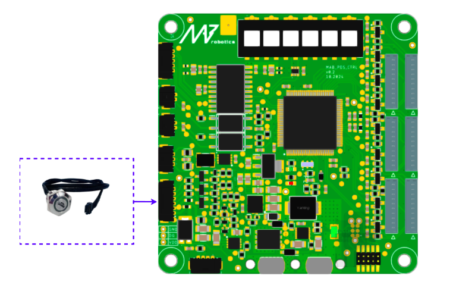
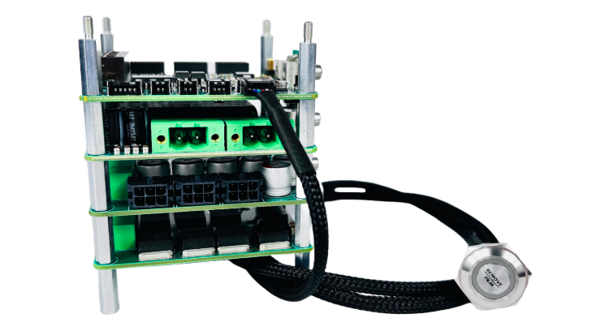
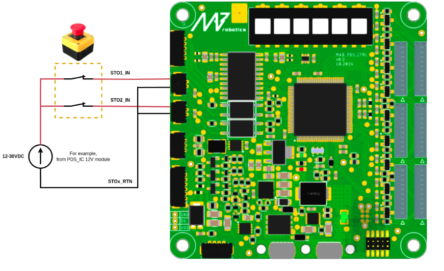
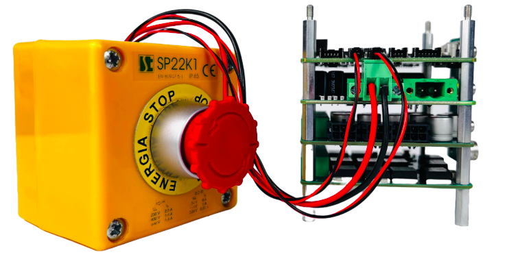
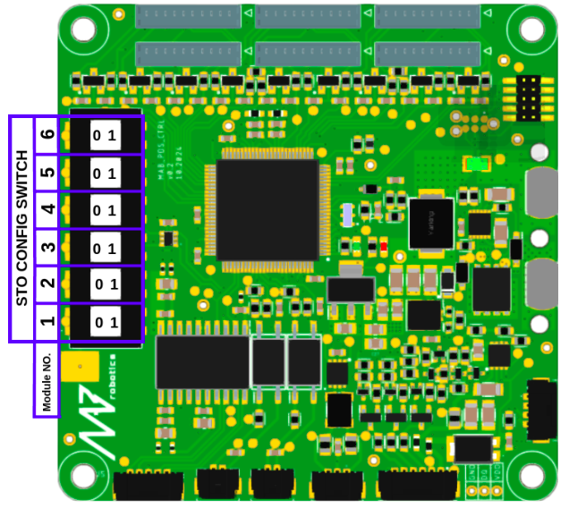

# PDS :: Quick Start Guide

1. Mount PDS device to the frame

2. Prepare all the harnesses delivered with PDS and connect them to PDS_CTRL:

## **RGB SWITCH**:



After connecting, the switch can be used to enable the PDS and monitor its state. Please remember to set the thresholds if the visual battery monitoring is needed.

The switch need to be connected as below:




## **STO1/2**
An example STO connection is presented below. The mechanism can be realized with pair of the normally closed contacts, or two different E-stops - like one mechanical, and the second one wireless to increase the safety. The STOx inputs need to be polarized with external voltage. It can be for example 12V from PDS_IC module, or from other power supply dedicated to safety in the application.



Example wired system can look like below:




Beside STO inputs, there is presented connection to the PDS_IC module. Such cable is not included in the set, but the housing is. The E-stop button is also NOT included.
Please note that the proposed solution is for reference only - the safety considerations has to be evaluated and analyzed properly to ensure that the solution match the requirements. Usage of the voltage from the IC module for supplying the E-stop circuits can be acceptable in the end application or not, dependly on the system architecture and needs.

The last step is configuration of the STO switch. The schematic diagram of the STO configuration is presented below:




The switch determines what happens with the connected modules after STO triggering. If set to 0 (left positon), module remains on. If set to 1 (right position), the power is cut off from particular module. Table below shows the effects of setting the switch in position 1 for different modules:

```{list-table}
:header-rows: 1

* - Module type
  - Enabled STO effect
* - Isolated Converter 
  - The power supply is cut off from the DC/DC converter. The results can be, for example, computers shut down
* - Power Stage
  - The load is disconnected from the power supply. Example result can be de-energization of the connected actuators - robot will fall down as the torque is no longer generated.
* - Brake Resistor
  - The energy is no longer dissipated in the resistor, independently of the voltage level on the DC bus.
```

For a real world application, the proper strategy can be to enable STO on the PS modules, and disable on the IC and BR module. In such case, the motors are instantaneously turned off, the computers are still working, and the potential regenerative energy that can appear on the motors bus is dissipated safely. Please note that the signal of the STO triggering is transmitted by the CTRL module over the CAN FD independently on the setting on the switch. There is possibility to implement other safety strategy, like setting the torque references to 0 on the actuators, or enabling the strong damping on the joints to, for example, make robot slowly fall down in controllable way, or enable breaking by shorting the motor phases. Please remember that such mechanism can be much slower and less reliable than the mechanism based on the hardware STO circuits, which are purely hardware based and only delay comes from the signals propagation delay and the bus capacitance discharging.

## **CAN FD**

CANdle or CANdle HAT should be connected to the CAN port of the Control board module.
```{image} ./images/canfd_connection.png
:alt: FD CAN Connection
:class: bg-primary mb-1
:width: 500px
:align: center
```
```{image} ./images/canfd_connection_example.png
:alt: FD CAN Connection example
:class: bg-primary mb-1
:width: 500px
:align: center
```
```{warning}
Please note that CAN interface on the PDS Control board is not connected to the Sockets on the Power Stage module. User should provide CAN lines connection to both the Control Board and the Drivers powered by the Power Stage module. 
```
## **Host SBC**

Prepare the wires to connect Your host SBC like RaspberryPI or NVidia Jetson with power output from the IC submodule. Ensure proper polarization before turning on the power supply to prevent damage to the load.
Below is the example wiring of the PDS IC module with computers:

```{image} ./images/sbc_connection.png
:alt: SBC Connection example
:class: bg-primary mb-1
:width: 500px
:align: center
```
## MD Drivers


```{image} ./images/md_connections.png
:alt: SBC Connection example 
:class: bg-primary mb-1
:width: 500px
:align: center
```
